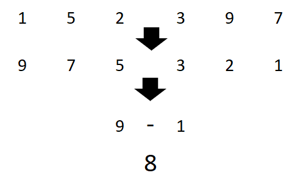
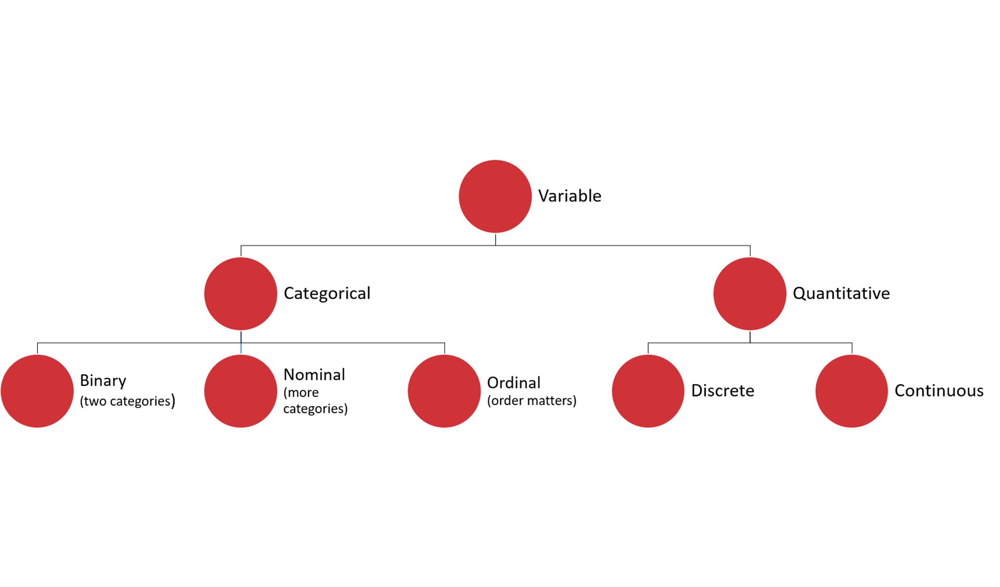

# Exploratory data analysis for quantitative variables

Here, we'll run a fuller range of *summary* or *descriptive* statistics.  

## Quantitative variables and descriptive statistics

Descriptive statistics are numeric summaries of a dataset. In fact, frequencies (which we covered in the last section) are one type of descriptive statistic: they tell us how many of each unique value there are. 

Let's walk through what some of these statistics are, then how to calculate them in Excel. 

#### Range

The range of a dataset is the difference between the minimum and maximum value. This measure is easiest to calculate if your data is sorted from low to high: 




# Variable types

We know that variables vary across observations. But variables can also be quite different from each other. Even in our relatively small dataset, we have text, numbers, and *yes/no* results all as variables.

It can help to classify these variable types, as these distinctions will be important as we continue our analysis. 

Keep in mind that these distinctions are somewhat arbitrary and may change based on the purpose of our analysis and the size of our datasets. You will see that EDA, and analytics in general, is highly iterative. 


=-=-=-=-=-=-=-=-=


Classifying variables is somewhat arbitrary and, like much of analytics, built on rules of thumb rather than hard-and-fast-criteria.  


=-=-=-=-=-=-=-=-

We will discuss the variable types as shown on this tree diagram. 




### Variance

This gives us the spread of the *entire* dataset without much context for how different each observation is from some point of reference.

A good point of reference is the mean, and *variance* tells us how far away observations fall from it. 

This measure is a bit more intensive to calculate than those we've covered this far. Our steps will be:

1. Find the mean of our dataset.
2. Subtract the mean from each observation. This is the *deviation*.
3. Take the sum of the squares of each deviation 
4. Divide the sum of square of each deviation by the number of observations.


That's a lot of steps! For operations this intensive, it can be helpful to use mathematical notation. I know they can some getting used to and be very intimidating at first, but consider the alternative of the written list above!

We can express the operations needed to find the variance like so: 

$s^{2}=\frac{\sum(X-\bar{X})^{2}}{N}$

$s^{2}$ is our variance. $(X-\bar{X})^{2}$ tells us that we need to subtract each observation $X$ from the average $\bar{X}$, and square it. ${\sum}$ tells us to sum those results . 

Finally, we will divide that by the number of observations ${N}$.

We'll use mathematical notation a few more times in the book. I'll make sure to label and walk through each equation, but I hope you can see that with practice, these actually become easier to read than a written list of steps. 

Now, calculate the variance of the following numbers:


```python

```
