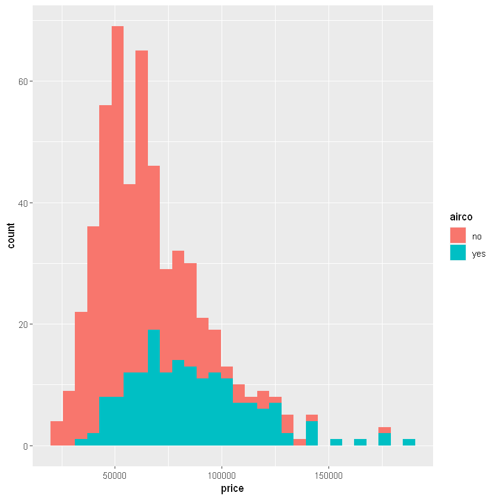
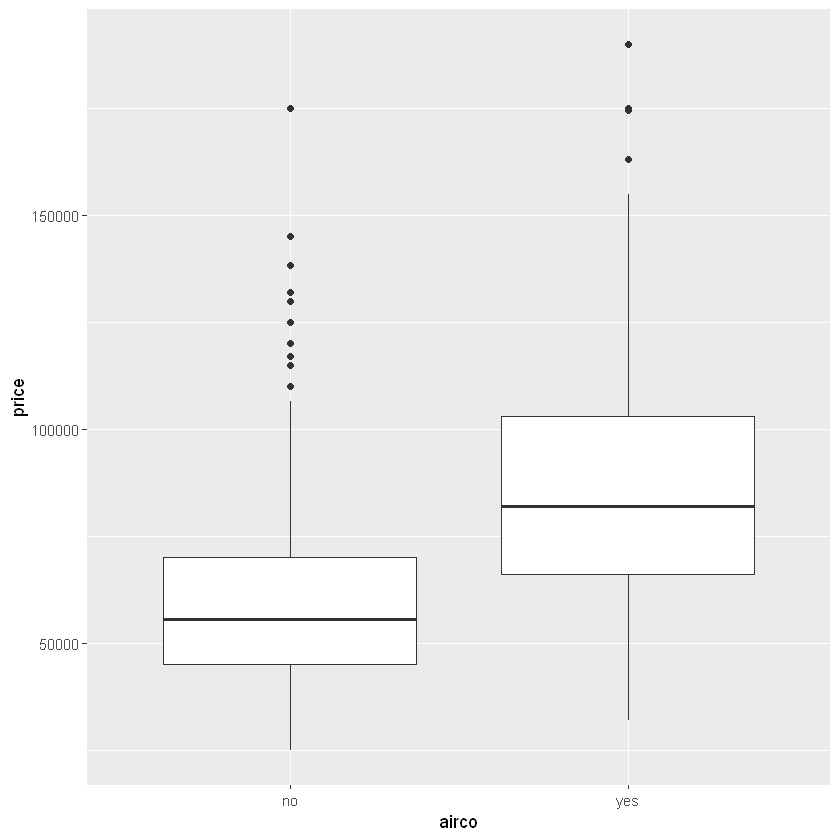
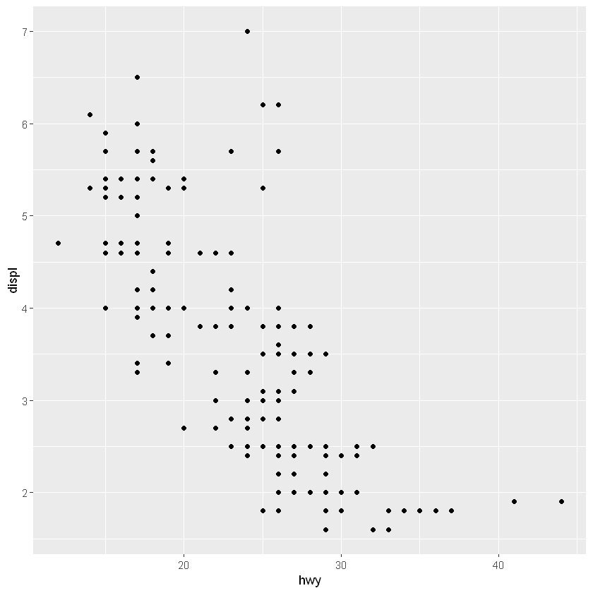
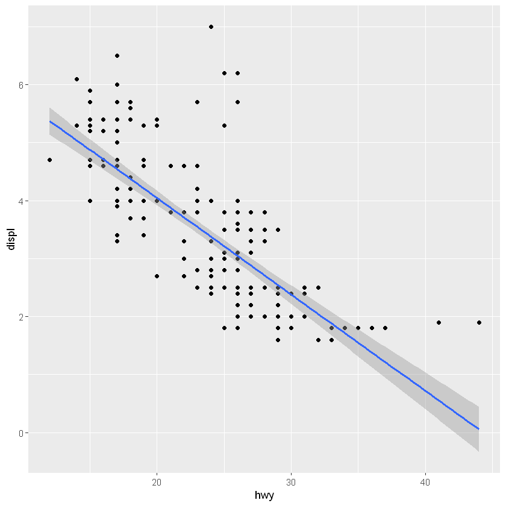

```R
library(tidyverse)
```

    -- Attaching packages --------------------------------------- tidyverse 1.3.0 --
    
    v ggplot2 3.3.2     v purrr   0.3.4
    v tibble  3.0.3     v dplyr   1.0.2
    v tidyr   1.1.2     v stringr 1.4.0
    v readr   1.3.1     v forcats 0.5.0
    
    -- Conflicts ------------------------------------------ tidyverse_conflicts() --
    x dplyr::filter() masks stats::filter()
    x dplyr::lag()    masks stats::lag()
    


```R
data(iris)
head(iris)
```


<table>
<caption>A data.frame: 6 × 5</caption>
<thead>
	<tr><th></th><th scope=col>Sepal.Length</th><th scope=col>Sepal.Width</th><th scope=col>Petal.Length</th><th scope=col>Petal.Width</th><th scope=col>Species</th></tr>
	<tr><th></th><th scope=col>&lt;dbl&gt;</th><th scope=col>&lt;dbl&gt;</th><th scope=col>&lt;dbl&gt;</th><th scope=col>&lt;dbl&gt;</th><th scope=col>&lt;fct&gt;</th></tr>
</thead>
<tbody>
	<tr><th scope=row>1</th><td>5.1</td><td>3.5</td><td>1.4</td><td>0.2</td><td>setosa</td></tr>
	<tr><th scope=row>2</th><td>4.9</td><td>3.0</td><td>1.4</td><td>0.2</td><td>setosa</td></tr>
	<tr><th scope=row>3</th><td>4.7</td><td>3.2</td><td>1.3</td><td>0.2</td><td>setosa</td></tr>
	<tr><th scope=row>4</th><td>4.6</td><td>3.1</td><td>1.5</td><td>0.2</td><td>setosa</td></tr>
	<tr><th scope=row>5</th><td>5.0</td><td>3.6</td><td>1.4</td><td>0.2</td><td>setosa</td></tr>
	<tr><th scope=row>6</th><td>5.4</td><td>3.9</td><td>1.7</td><td>0.4</td><td>setosa</td></tr>
</tbody>
</table>


```R
fit1 <- lm(Sepal.Length ~ Petal.Width, data = iris)
summary(fit1)
```


    
    Call:
    lm(formula = Sepal.Length ~ Petal.Width, data = iris)
    
    Residuals:
         Min       1Q   Median       3Q      Max 
    -1.38822 -0.29358 -0.04393  0.26429  1.34521 
    
    Coefficients:
                Estimate Std. Error t value Pr(>|t|)    
    (Intercept)  4.77763    0.07293   65.51   <2e-16 ***
    Petal.Width  0.88858    0.05137   17.30   <2e-16 ***
    ---
    Signif. codes:  0 '***' 0.001 '**' 0.01 '*' 0.05 '.' 0.1 ' ' 1
    
    Residual standard error: 0.478 on 148 degrees of freedom
    Multiple R-squared:  0.669,	Adjusted R-squared:  0.6668 
    F-statistic: 299.2 on 1 and 148 DF,  p-value: < 2.2e-16


library(ggplot2)

ggplot(iris, aes(x = Petal.Width, y = Sepal.Length)) + 
  geom_point() +
  stat_smooth(method = "lm", col = "red")


```R
library(readxl)
housing <- read_xlsx("housing.xlsx")
head(housing)
```


<table>
<caption>A tibble: 6 × 13</caption>
<thead>
	<tr><th scope=col>price</th><th scope=col>lotsize</th><th scope=col>bedrooms</th><th scope=col>bathrms</th><th scope=col>stories</th><th scope=col>driveway</th><th scope=col>recroom</th><th scope=col>fullbase</th><th scope=col>gashw</th><th scope=col>airco</th><th scope=col>garagepl</th><th scope=col>prefarea</th><th scope=col>neighborhood</th></tr>
	<tr><th scope=col>&lt;dbl&gt;</th><th scope=col>&lt;dbl&gt;</th><th scope=col>&lt;dbl&gt;</th><th scope=col>&lt;dbl&gt;</th><th scope=col>&lt;dbl&gt;</th><th scope=col>&lt;chr&gt;</th><th scope=col>&lt;chr&gt;</th><th scope=col>&lt;chr&gt;</th><th scope=col>&lt;chr&gt;</th><th scope=col>&lt;chr&gt;</th><th scope=col>&lt;dbl&gt;</th><th scope=col>&lt;chr&gt;</th><th scope=col>&lt;chr&gt;</th></tr>
</thead>
<tbody>
	<tr><td>42000</td><td>5850</td><td>3</td><td>1</td><td>2</td><td>yes</td><td>no </td><td>yes</td><td>no</td><td>no </td><td>1</td><td>no</td><td>Blmngtn</td></tr>
	<tr><td>38500</td><td>4000</td><td>2</td><td>1</td><td>1</td><td>yes</td><td>no </td><td>no </td><td>no</td><td>no </td><td>0</td><td>no</td><td>SawyerW</td></tr>
	<tr><td>49500</td><td>3060</td><td>3</td><td>1</td><td>1</td><td>yes</td><td>no </td><td>no </td><td>no</td><td>no </td><td>0</td><td>no</td><td>SawyerW</td></tr>
	<tr><td>60500</td><td>6650</td><td>3</td><td>1</td><td>2</td><td>yes</td><td>yes</td><td>no </td><td>no</td><td>no </td><td>0</td><td>no</td><td>NWAmes </td></tr>
	<tr><td>61000</td><td>6360</td><td>2</td><td>1</td><td>1</td><td>yes</td><td>no </td><td>no </td><td>no</td><td>no </td><td>0</td><td>no</td><td>Blmngtn</td></tr>
	<tr><td>66000</td><td>4160</td><td>3</td><td>1</td><td>1</td><td>yes</td><td>yes</td><td>yes</td><td>no</td><td>yes</td><td>0</td><td>no</td><td>Gilbert</td></tr>
</tbody>
</table>


```R
t.test(price ~ airco, data=housing)
```


    
    	Welch Two Sample t-test
    
    data:  price by airco
    t = -10.699, df = 265.03, p-value < 2.2e-16
    alternative hypothesis: true difference in means is not equal to 0
    95 percent confidence interval:
     -30779.85 -21211.62
    sample estimates:
     mean in group no mean in group yes 
             59884.85          85880.59 


```R
# Overlaid histograms
ggplot(housing, aes(x=price, fill=airco)) +
  geom_histogram()
```

    `stat_bin()` using `bins = 30`. Pick better value with `binwidth`.
    


```R
# Overlaid histograms
ggplot(housing, aes(x=price,fill=airco)) +
  geom_histogram()
```

    `stat_bin()` using `bins = 30`. Pick better value with `binwidth`.
    





```R
ggplot(housing, aes(x=airco, y=price)) + 
  geom_boxplot()
```





```R
head(mpg)
```


<table>
<caption>A tibble: 6 × 11</caption>
<thead>
	<tr><th scope=col>manufacturer</th><th scope=col>model</th><th scope=col>displ</th><th scope=col>year</th><th scope=col>cyl</th><th scope=col>trans</th><th scope=col>drv</th><th scope=col>cty</th><th scope=col>hwy</th><th scope=col>fl</th><th scope=col>class</th></tr>
	<tr><th scope=col>&lt;chr&gt;</th><th scope=col>&lt;chr&gt;</th><th scope=col>&lt;dbl&gt;</th><th scope=col>&lt;int&gt;</th><th scope=col>&lt;int&gt;</th><th scope=col>&lt;chr&gt;</th><th scope=col>&lt;chr&gt;</th><th scope=col>&lt;int&gt;</th><th scope=col>&lt;int&gt;</th><th scope=col>&lt;chr&gt;</th><th scope=col>&lt;chr&gt;</th></tr>
</thead>
<tbody>
	<tr><td>audi</td><td>a4</td><td>1.8</td><td>1999</td><td>4</td><td>auto(l5)  </td><td>f</td><td>18</td><td>29</td><td>p</td><td>compact</td></tr>
	<tr><td>audi</td><td>a4</td><td>1.8</td><td>1999</td><td>4</td><td>manual(m5)</td><td>f</td><td>21</td><td>29</td><td>p</td><td>compact</td></tr>
	<tr><td>audi</td><td>a4</td><td>2.0</td><td>2008</td><td>4</td><td>manual(m6)</td><td>f</td><td>20</td><td>31</td><td>p</td><td>compact</td></tr>
	<tr><td>audi</td><td>a4</td><td>2.0</td><td>2008</td><td>4</td><td>auto(av)  </td><td>f</td><td>21</td><td>30</td><td>p</td><td>compact</td></tr>
	<tr><td>audi</td><td>a4</td><td>2.8</td><td>1999</td><td>6</td><td>auto(l5)  </td><td>f</td><td>16</td><td>26</td><td>p</td><td>compact</td></tr>
	<tr><td>audi</td><td>a4</td><td>2.8</td><td>1999</td><td>6</td><td>manual(m5)</td><td>f</td><td>18</td><td>26</td><td>p</td><td>compact</td></tr>
</tbody>
</table>


```R
names(mpg)
```


<style>
.list-inline {list-style: none; margin:0; padding: 0}
.list-inline>li {display: inline-block}
.list-inline>li:not(:last-child)::after {content: "\00b7"; padding: 0 .5ex}
</style>
<ol class=list-inline><li>'manufacturer'</li><li>'model'</li><li>'displ'</li><li>'year'</li><li>'cyl'</li><li>'trans'</li><li>'drv'</li><li>'cty'</li><li>'hwy'</li><li>'fl'</li><li>'class'</li></ol>


```R
# Scatterplot
ggplot(data=mpg, aes(x=hwy, y=displ)) +
    geom_point() 
```





```R
mpg_reg <- lm(displ ~ hwy, data=mpg)
summary(mpg_reg)
```


    
    Call:
    lm(formula = displ ~ hwy, data = mpg)
    
    Residuals:
        Min      1Q  Median      3Q     Max 
    -1.4126 -0.5710 -0.1105  0.4571  3.6212 
    
    Coefficients:
                 Estimate Std. Error t value Pr(>|t|)    
    (Intercept)  7.367570   0.221422   33.27   <2e-16 ***
    hwy         -0.166201   0.009157  -18.15   <2e-16 ***
    ---
    Signif. codes:  0 '***' 0.001 '**' 0.01 '*' 0.05 '.' 0.1 ' ' 1
    
    Residual standard error: 0.8323 on 232 degrees of freedom
    Multiple R-squared:  0.5868,	Adjusted R-squared:  0.585 
    F-statistic: 329.5 on 1 and 232 DF,  p-value: < 2.2e-16


```R
# Add regression line
ggplot(data=mpg, aes(x=hwy, y=displ)) +
    geom_point() +    
    geom_smooth(method=lm)   
```

    `geom_smooth()` using formula 'y ~ x'
    





```R

```
